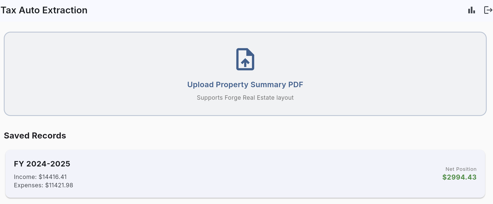
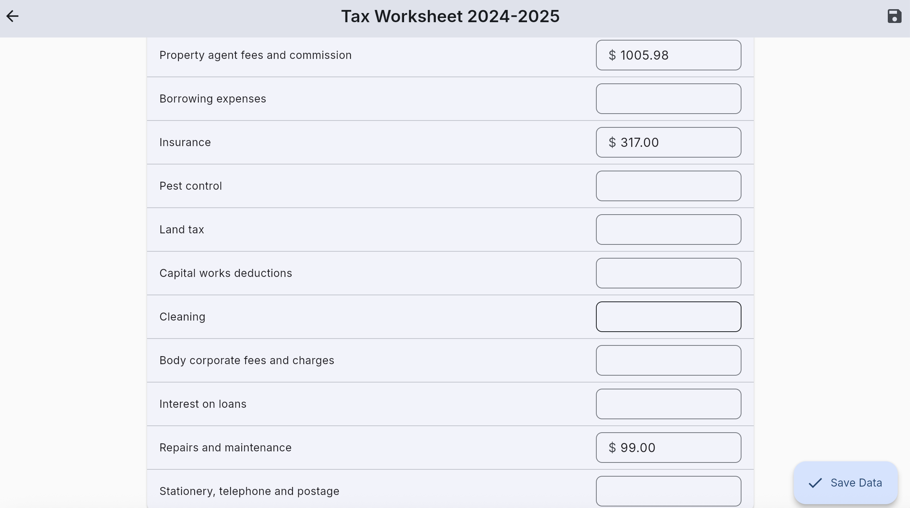
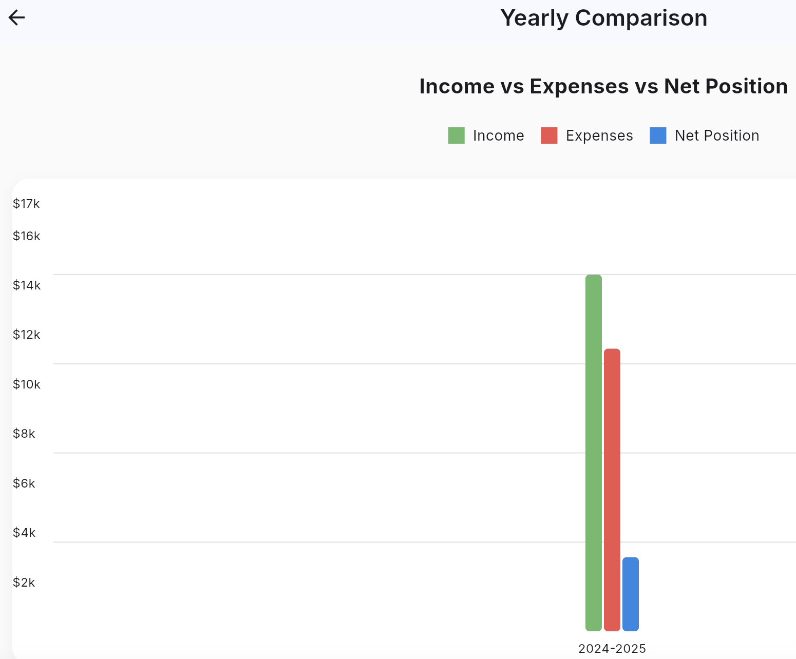
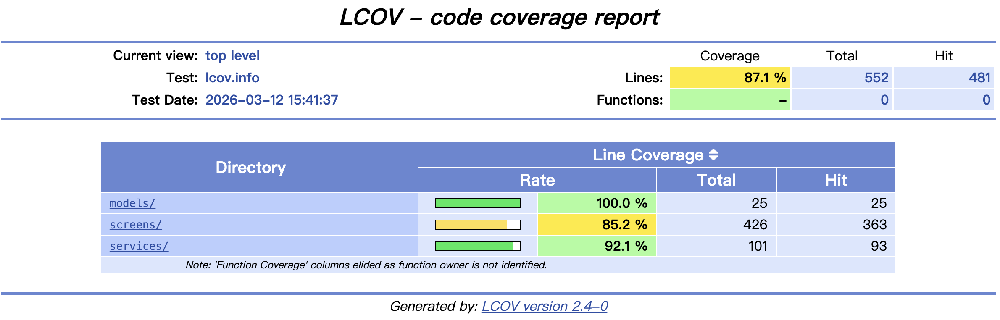

# 🏠 Tax Auto Extraction

A Flutter application that helps Australian investment property owners automatically extract income and expense data from their property management PDF statements, categorize them according to the **ATO Rental Property Worksheet**, and track trends across financial years for negative gearing and tax return purposes.

---

## ✨ Features

- **🔐 Authentication** — Secure sign-up, login, and logout powered by Firebase Auth.
- **📄 PDF Upload & Extraction** — Upload your end-of-year Income & Expenditure Summary PDF and automatically extract categorized income and expenses.
- **📝 ATO Worksheet Mapping** — Extracted data is mapped to official ATO Rental Property Worksheet categories (Gross rent, Insurance, Repairs, Agent fees, etc.).
- **✏️ Manual Editing** — Review and adjust any extracted values before saving.
- **💾 Cloud Storage** — Save records to Firebase Firestore, with per-user data isolation via security rules.
- **📊 Year-over-Year Comparison** — Visualize income, expenses, and net position trends across multiple financial years with interactive bar charts.

---

## 📸 Screenshots

| Login | Dashboard | Worksheet | Chart Comparison |
|:---:|:---:|:---:|:---:|
|  |  |  |  |

---

## 🛠 Tech Stack

| Layer | Technology |
|---|---|
| Framework | Flutter (Dart) |
| Authentication | Firebase Auth |
| Database | Cloud Firestore |
| PDF Parsing | Syncfusion Flutter PDF |
| File Picker | file_picker |
| Charts | fl_chart |
| Typography | Google Fonts (Inter) |

---

## 🚀 Getting Started

### Prerequisites

- [Flutter SDK](https://docs.flutter.dev/get-started/install) installed
- A configured [Firebase project](https://console.firebase.google.com/)
- `flutterfire_cli` activated (`dart pub global activate flutterfire_cli`)

### Setup

1. **Clone the repository**
   ```bash
   git clone https://github.com/LEO0331/simpletaxautoextraction.git
   cd simpletaxautoextraction
   ```

2. **Configure Firebase**
   ```bash
   flutterfire configure
   ```
   This generates `lib/firebase_options.dart` and platform-specific config files.

3. **Set Firestore Security Rules**

   In your [Firebase Console → Firestore → Rules](https://console.firebase.google.com/), paste the contents of `firestore.rules` and publish.

4. **Install dependencies**
   ```bash
   flutter pub get
   ```

5. **Run the app**
   ```bash
   # Web (Chrome)
   flutter run -d chrome

   # macOS
   flutter run -d macos
   ```

---

## 📁 Project Structure

```
lib/
├── main.dart                          # App entry point & auth routing
├── firebase_options.dart              # Auto-generated Firebase config (gitignored)
├── models/
│   └── tax_record.dart                # TaxRecord data model (ATO categories)
├── services/
│   ├── auth_service.dart              # Firebase Auth wrapper
│   ├── firestore_service.dart         # Firestore CRUD operations
│   └── pdf_extraction_service.dart    # PDF text extraction & parsing
└── screens/
    ├── auth_screen.dart               # Login / Sign-up UI
    ├── home_screen.dart               # Dashboard with PDF upload & saved records
    ├── worksheet_screen.dart          # ATO worksheet view with editable fields
    └── comparison_screen.dart         # Multi-year bar chart comparison
```

---

## 🔒 Security and test coverage

- **Firebase Auth** ensures only authenticated users can access data.
- **Firestore Security Rules** enforce that each user can only read/write their own `tax_records` subcollection.


---

## 📋 Supported PDF Formats

Currently supports the **Forge Real Estate** Income & Expenditure Summary layout. The parser extracts:

- **Income**: Residential Rent, Water Rates, and other property income
- **Expenses**: Administration Fee, Management Fee, Letting Fee, Insurance, Repairs & Maintenance (mapped to ATO categories)

> To support additional property management PDF formats, extend the `_parseExtractedText()` method in `pdf_extraction_service.dart`.

---

## 📄 Demo
[Demo](https://leo0331.github.io/simpletaxautoextraction/)
