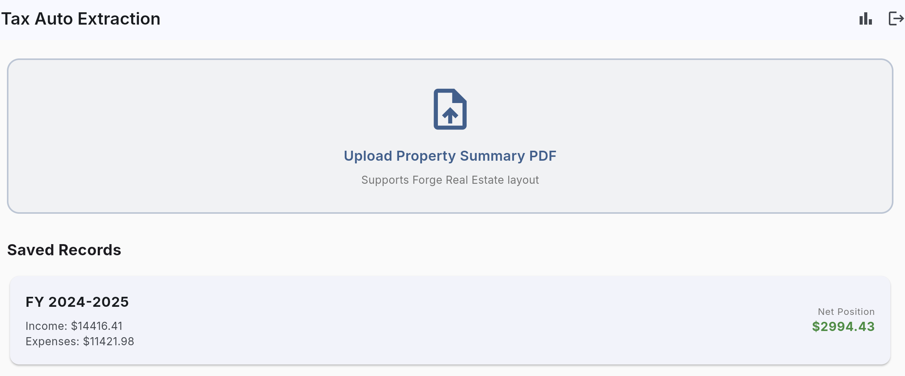
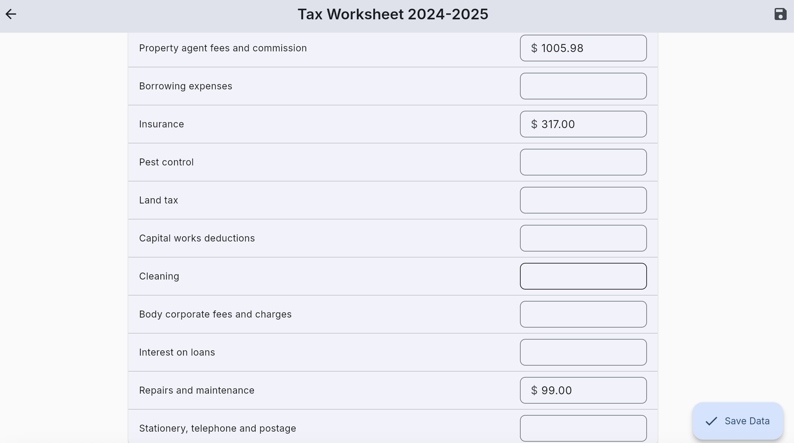
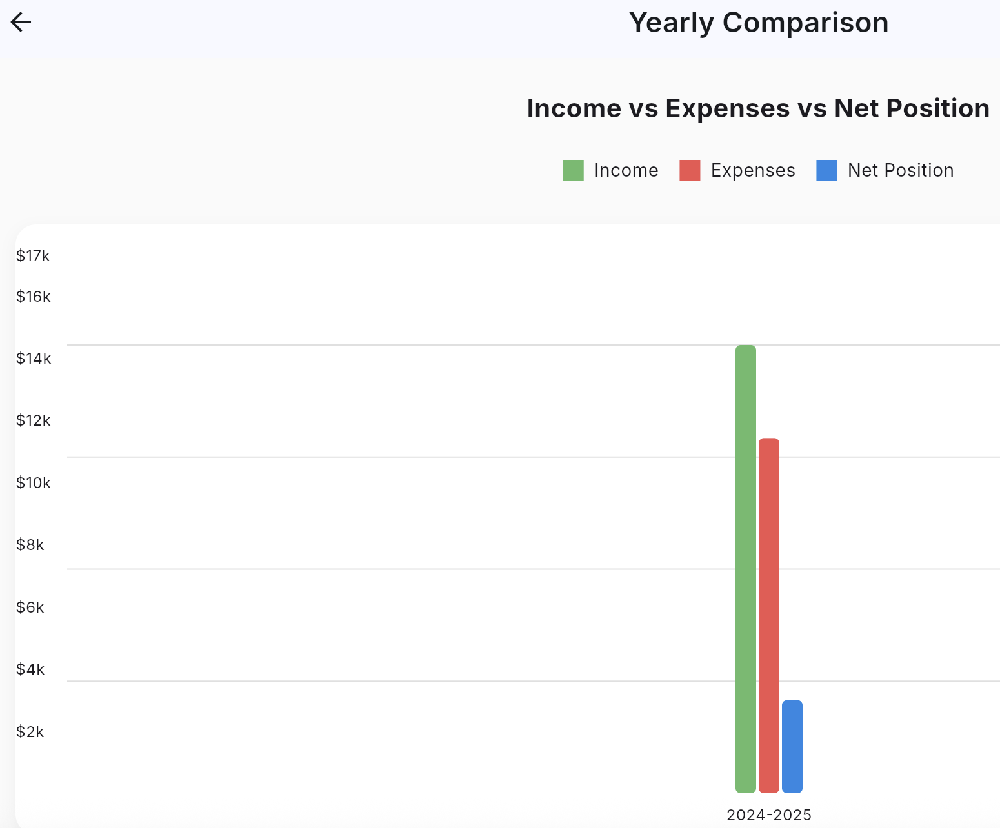
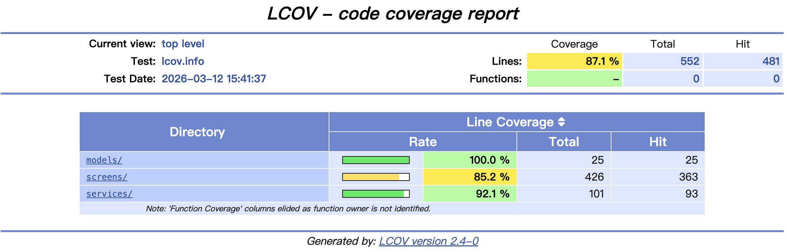

# 🏠 Tax Auto Extraction

A Flutter application that helps Australian investment property owners automatically extract income and expense data from their property management PDF statements, categorize them according to the **ATO Rental Property Worksheet**, and track trends across financial years for negative gearing and tax return purposes.

---

## ✨ Features

- **🔐 Authentication** — Secure sign-up, login, and logout powered by Firebase Auth.
- **📄 PDF Upload & Extraction** — Supports Forge monthly EOFY summaries and the older Debit/Credit/Total format. Monthly rows are checked against annual totals and report subtotals without adding GST twice.
- **📝 ATO Worksheet Mapping** — Maps recognized entries to rental worksheet categories. Unknown income and expenses require an explicit category choice; custom rules accept only supported destinations.
- **🔎 Import Review** — Shows extracted totals, blocks empty or unreconciled imports, and lets you correct a detected financial-year mismatch directly in the preview. Reviewed categories are retained in source line-item details.
- **✏️ Manual Editing** — Review and adjust any extracted values before saving.
- **💾 Cloud Storage** — Save records to Firebase Firestore, with per-user data isolation via security rules.
- **📅 Save Safeguards** — Reimports show category-level changes before updating an existing property/year. Save As New Year rejects the source year and existing target records.
- **📊 Year-over-Year Comparison** — Visualize income, expenses, and net position trends across multiple financial years with interactive bar charts.

---

## 📸 Screenshots

| Login | Dashboard | Worksheet | Chart Comparison |
|:---:|:---:|:---:|:---:|
|  |  |  |  |

---

## 🛠 Tech Stack

| Layer | Technology |
|---|---|
| Framework | Flutter (Dart) |
| Authentication | Firebase Auth |
| Database | Cloud Firestore |
| PDF Parsing | Syncfusion Flutter PDF |
| File Picker | file_picker |
| Charts | fl_chart |
| Typography | Google Fonts (Inter) |

---

## 🚀 Getting Started

### Prerequisites

- [Flutter SDK](https://docs.flutter.dev/get-started/install) installed
- A configured [Firebase project](https://console.firebase.google.com/)
- `flutterfire_cli` activated (`dart pub global activate flutterfire_cli`)

### Setup

1. **Clone the repository**
   ```bash
   git clone https://github.com/LEO0331/simpletaxautoextraction.git
   cd simpletaxautoextraction
   ```

2. **Configure Firebase**
   ```bash
   flutterfire configure
   ```
   This generates `lib/firebase_options.dart` and platform-specific config files.

3. **Set Firestore Security Rules**

   In your [Firebase Console → Firestore → Rules](https://console.firebase.google.com/), paste the contents of `firestore.rules` and publish.

4. **Install dependencies**
   ```bash
   flutter pub get
   ```

5. **Run the app**
   ```bash
   # Web (Chrome)
   flutter run -d chrome

   # macOS
   flutter run -d macos
   ```

---

## 📁 Project Structure

```
lib/
├── main.dart                          # App entry point & auth routing
├── firebase_options.dart              # Auto-generated Firebase config (gitignored)
├── models/
│   └── tax_record.dart                # TaxRecord data model (ATO categories)
├── services/
│   ├── auth_service.dart              # Firebase Auth wrapper
│   ├── firestore_service.dart         # Firestore CRUD operations
│   └── pdf_extraction_service.dart    # PDF text extraction & parsing
└── screens/
    ├── auth_screen.dart               # Login / Sign-up UI
    ├── home_screen.dart               # Dashboard with PDF upload & saved records
    ├── worksheet_screen.dart          # ATO worksheet view with editable fields
    └── comparison_screen.dart         # Multi-year bar chart comparison
```

---

## 🔒 Security and test coverage

- **Firebase Auth** ensures only authenticated users can access data.
- **Firestore Security Rules** enforce per-user ownership for `tax_records`, `properties`, and mapping `settings`.
- **Record validation in rules** checks required fields and caps long text fields to reduce malformed writes.
- **Session persistence on web** is set to `SESSION` so closing the tab clears that tab's auth session.


---

## ✅ Pre-launch checklist

- Publish latest `firestore.rules` from this repo.
- Enable HTTPS-only hosting for production.
- Review `web/index.html`, `web/robots.txt`, and `web/sitemap.xml` metadata after deploy.
- Verify no debug logs or test-only credentials are bundled.
- Confirm contact endpoint in `web/.well-known/security.txt` is monitored.
- Run [docs/PRODUCTION_HARDENING_CHECKLIST.md](docs/PRODUCTION_HARDENING_CHECKLIST.md) for Firebase console hardening and final GO/NO-GO sign-off.

---

## 📋 Supported PDF Formats

The property parser supports:

- **Forge monthly EOFY summaries**, including the FY 2025-2026 layout with July through June columns and an annual Total column. The parser reads each annual amount once, checks monthly sums and section subtotals, and excludes owner payments from rental income. Expenses marked GST Inclusive already include GST.
- **Older Forge summaries** with Debit/Credit/Total amounts and separate GST rows.
- **Generic property statements** with recognized Income/Expenses headers and the supported three-value currency structure. Other layouts may require parser changes.

Recognized categories include Residential Rent, Compensation, Water Rates, Administration Fee, Management Fee, Letting Fee, Insurance, and Repairs & Maintenance. Unrecognized entries, such as Locks, Keys, Card Keys, remain visible for category review unless a valid custom mapping applies.

To add a layout, extend `PdfExtractionService` in `lib/services/pdf_extraction_service.dart` and add synthetic regression fixtures. See [PDF parsing guidance](docs/harness/pdf-parsing.md).

### Property import and save workflow

1. Select the property, upload its PDF, and choose the financial year.
2. Review extracted totals and validation messages. If the report identifies a different year, select **Use FY …** in the preview. This clears the year mismatch while preserving other validation errors.
3. Choose a destination for every unmapped income or expense entry. **Continue to Worksheet** stays disabled for empty extraction, validation errors, or missing category choices.
4. If a record already exists for that property/year, review the overwrite preview. It shows category reallocations even when overall totals are unchanged.
5. Adjust worksheet amounts and notes, then save. **Save As New Year** creates a separate copy only when the selected year differs from the source and no target record exists.

Custom Mapping Rules use one `keyword=ATO Category` rule per line, with separate income and expense lists. Invalid rules stay open for correction. Invalid destinations in previously stored rules produce reviewable entries instead of unsupported worksheet categories.

Ordinary failed saves can be queued for sync during the current session. Failed new-year copies stay in the worksheet for retry; they are not queued as ordinary updates that could overwrite another record.

### Verification

```bash
flutter analyze --fatal-infos --fatal-warnings
flutter test
```

Regression coverage includes both Forge layouts, reconciliation failures, invalid mappings, reviewed source metadata, year correction, category-level overwrite previews, and new-year copy safeguards.

The optional local PDF integration test reads a private FY 2025-2026 Forge report through the production extractor. It is skipped unless `FORGE_MONTHLY_SAMPLE_PDF_PATH` is set. In PowerShell:

```powershell
$env:FORGE_MONTHLY_SAMPLE_PDF_PATH = 'C:\private\forge-monthly-report.pdf'
flutter test test/integration/forge_monthly_pdf_integration_test.dart
Remove-Item Env:FORGE_MONTHLY_SAMPLE_PDF_PATH
```

This test asserts the verified reference report's totals; it is not a generic check for any Forge PDF. Keep personal PDFs outside version control and use synthetic text fixtures for routine tests.

---

## 📄 Demo
[Demo](https://leo0331.github.io/simpletaxautoextraction/)
