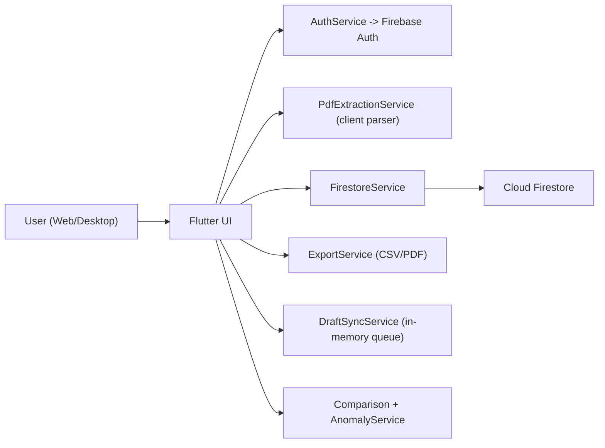

# Tax Auto Extraction: System Design Deep Dive

Last updated: 2026-05-08

## 1) Executive Summary

This system is a serverless, client-centric Flutter app backed by Firebase Auth and Firestore.  
Core flow:

1. User authenticates via Firebase Auth.
2. User uploads PDF from device.
3. Client parses PDF into ATO-aligned `TaxRecord`.
4. User reviews/edits data in worksheet UI.
5. App saves per-user records to Firestore with ownership and schema checks in rules.
6. App visualizes historical trends and detects anomalies client-side.

Primary design goal: fast delivery and low ops overhead for a single-tenant-per-user workflow, with strong per-user data isolation.

## 2) Architecture Overview

Key boundaries:

- UI layer: `lib/screens/*`
- Domain model: `lib/models/tax_record.dart`
- Data/services layer: `lib/services/*`
- Persistence guardrails: `firestore.rules`

## 3) Current Data Model

Firestore path strategy:

- `users/{userId}/tax_records/{recordId}`
- `users/{userId}/settings/mappings`
- `users/{userId}/properties/{propertyId}`

Primary entity: `TaxRecord`

- Identifier and ownership: `id`, `userId`
- Time partition: `financialYear` string (`YYYY-YYYY`)
- Data payload:
  - `income: Map<String, double>`
  - `expenses: Map<String, double>`
  - `lineItems: List<Map<String, dynamic>>`
- Operational metadata: `createdAt`, `updatedAt`, `sourceFileName`, `sourceParser`, `parserVersion`
- UX/business flags: `propertyId`, `propertyName`, `notes`, `isLocked`

## 4) Why These Data Structures Were Chosen

### 4.1 `Map<String, double>` for `income` and `expenses`

Current choice:

- `Map<String, double>` keyed by category label.

Why chosen:

- O(1) update when user edits a single category in worksheet.
- Easy aggregate (`sum(values)`) for income/expense/net.
- Flexible for parser/custom mappings and future category additions.
- Matches UI shape where categories are rendered by label.

Alternative:

- `List<CategoryAmount>` where each item is `{categoryId, amount}`.

Tradeoff:

- `List` is better for strict schema and ordering control.
- `Map` is better for update simplicity and low-friction category evolution.

When to switch:

- If category taxonomy becomes strict/versioned and queryable by category id across users.

### 4.2 `financialYear` as `String` (`YYYY-YYYY`)

Current choice:

- Normalized string with regex validation in UI and rules.

Why chosen:

- Human-readable and UI-ready.
- Lexicographically sortable for timeline display.
- No timezone/date-boundary complexity.

Alternative:

- Two ints (`startYear`, `endYear`) or single int key (`startYear`).

Tradeoff:

- Int-based fields reduce parse/validation overhead and enforce type.
- String is simpler in a form-driven app and already well-constrained.

When to switch:

- If advanced analytics require richer date arithmetic or financial calendar variants.

### 4.3 User-scoped subcollections (`users/{uid}/...`)

Current choice:

- Tenant partitioning by path hierarchy.

Why chosen:

- Security rules become straightforward (`request.auth.uid == userId`).
- Reduces accidental cross-user query/read risks.
- Keeps documents naturally grouped per user.

Alternative:

- Top-level `tax_records` with `userId` field and composite indexes.

Tradeoff:

- Top-level enables easier global analytics queries.
- Subcollections maximize isolation and security clarity for SMB-scale apps.

When to switch:

- If admin/global analytics across all users becomes a first-class requirement.

### 4.4 `lineItems` as `List<Map<String, dynamic>>`

Current choice:

- Flexible event-like raw extraction entries.

Why chosen:

- Parser can emit variable shape quickly.
- Supports source traceability (`sourceCategory`, `mappedCategory`, `amount`, `isIncome`).
- Useful for review/preview transparency.

Alternative:

- Strongly typed `LineItem` model with schema versioning.

Tradeoff:

- Typed model improves safety and migration control.
- Dynamic map minimizes implementation friction while parser formats evolve.

When to switch:

- If line-item semantics stabilize and become critical for reporting/audit exports.

### 4.5 Duplicate-resolution strategy (query by year + property before save)

Current choice:

- Lookup existing document by `financialYear` + `propertyId`, then update/replace.

Why chosen:

- Supports user-friendly overwrite behavior.
- Avoids hard collisions when document IDs are random.

Alternative:

- Deterministic document id like `${propertyId}_${financialYear}`.

Tradeoff:

- Deterministic id makes uniqueness explicit and removes duplicate query round-trip.
- Query-based approach preserves flexibility if uniqueness policy changes later.

When to switch:

- If write contention/race risk grows or strict uniqueness guarantees are required.

### 4.6 In-memory draft queue for offline-ish retry

Current choice:

- `DraftSyncService` singleton storing pending drafts in memory.

Why chosen:

- Very low complexity fallback for transient save failures.
- No extra storage dependencies.

Alternative:

- Persistent queue in local DB (`Hive`/`sqflite`) or IndexedDB/web storage.

Tradeoff:

- In-memory queue is simple but volatile (lost on app restart/refresh).
- Persistent queue is more reliable but adds schema, migration, and sync complexity.

When to switch:

- If offline-first reliability is required beyond a single runtime session.

## 5) Service Design and Tradeoffs

### 5.1 `PdfExtractionService`

Current:

- Client-side parser with layout detection (`Forge` vs generic), heuristics, custom mappings, confidence score, unmapped entries.

Pros:

- No backend parsing infrastructure.
- Immediate feedback and preview UX.
- Lower server cost.

Cons:

- Parser updates require client deployment.
- Parsing runs on user device; performance depends on client capability.
- Harder to centrally patch extraction bugs instantly.

Alternative:

- Backend parsing via Cloud Functions/Cloud Run.

Tradeoff:

- Backend parsing centralizes logic/versioning and can improve consistency.
- Increases latency, infra complexity, and sensitive file transfer surface.

### 5.2 `FirestoreService`

Current:

- Thin repository around Firestore with path conventions and save strategies.

Pros:

- Easy to mock in tests.
- Isolates Firestore API from UI.

Cons:

- Some policy logic (duplicate handling) remains in app tier; race-safe uniqueness is not fully enforced at DB schema level.

Alternative:

- Domain service layer with transaction/constraint abstractions.

### 5.3 `AnomalyService`

Current:

- Simple threshold-based percent delta check (30%).

Pros:

- Explainable, deterministic, low-cost.

Cons:

- Can generate false positives for low baselines.
- No seasonality or robust statistical baseline.

Alternative:

- Median-based bands, z-score on rolling history, or model-based anomaly detection.

## 6) Security Architecture

Current controls:

- Authenticated access required.
- Ownership enforced by path (`isOwner(userId)`).
- Tax record schema allowlist and field constraints in rules.
- Limited length checks for text fields.

Strengths:

- Strong tenant isolation model.
- Rules guard against malformed/extra fields.

Known gaps:

- `income`/`expenses` map keys and numeric ranges are not strongly validated in rules.
- `lineItems` structure is checked as list but not deeply validated per item.
- Uniqueness by year+property is app-enforced, not rule-enforced.

Hardening alternatives:

- Move to typed nested maps with key validation.
- Add Cloud Functions write gateway for stricter schema checks.
- Deterministic IDs to enforce uniqueness by key design.

## 7) Scalability and Performance Considerations

Current scaling profile:

- Good for early-stage single-user scoped workloads.
- Read pattern: stream ordered records for one user, then filter by property in client.

Potential bottlenecks:

- Client-side filtering after stream can grow inefficient with many records/properties.
- PDF parsing cost on low-end devices.

Alternatives:

- Query records by `propertyId` + ordered year directly (requires index strategy).
- Paginate historical records.
- Precompute aggregates for chart view.

## 8) Reliability and Failure Handling

Current:

- Save failures queue a draft in-memory and offer retry.
- Home screen attempts queued sync.

Tradeoff:

- Good transient-failure UX, but queue is non-durable.

Alternative:

- Durable local queue with backoff policy and sync status UI.

## 9) Testing Architecture

Current:

- Unit and widget test heavy approach with high coverage.
- Patrol E2E scenarios on Chrome for critical paths.

Strength:

- Good confidence in UI flows and services.

Gap:

- No backend integration environment tests for rule rejection edge cases under real project constraints.

Alternative:

- Add Firebase emulator integration tests for rules and query/index behavior.

## 10) Deep Dive Q&A Prep

### Architecture

Q: Why serverless Firebase over custom backend?  
A: Minimizes operational burden and time-to-market; security rules + auth provide acceptable control for user-scoped data.

Q: Why client-side PDF parsing?  
A: Faster iteration and zero backend parsing infra. Chosen for MVP speed and cost.

Q: What is your boundary between UI and data logic?  
A: Screens orchestrate flow; services encapsulate auth, persistence, parsing, export, anomalies.

### Data Structures

Q: Why map-based categories instead of typed list?  
A: O(1) edits and flexible category evolution. Alternative list is stronger for schema rigidity and analytics.

Q: Why `financialYear` as string?  
A: Human-readable, sort-friendly, low complexity for current use; int pair is alternative for stricter typing.

Q: How do you avoid duplicate year records?  
A: Query existing by year+property before save and update existing unless user chooses save-as-new-year.

### Security

Q: How is tenant isolation enforced?  
A: Firestore path partition plus rule ownership check (`request.auth.uid == userId`).

Q: Can a user write unexpected fields?  
A: Rules use key allowlist for tax records. Unknown fields are rejected.

Q: What are current rule limitations?  
A: Limited deep validation for `lineItems` and category map contents.

### Reliability

Q: What happens if save fails?  
A: Draft queued in memory, user sees retry, later sync attempts flush queue.

Q: Why not durable offline queue?  
A: Deferred to keep MVP complexity low; durability is next reliability milestone.

### Performance

Q: Where are likely hotspots?  
A: Client PDF parsing and broad record streams filtered in UI when dataset grows.

Q: First optimization step?  
A: Server query by `propertyId` and pagination/aggregation.

### Product/Extensibility

Q: How do you onboard new property statement formats?  
A: Extend parser layout signatures/mappings in `PdfExtractionService`; parser metadata/version is already captured.

Q: How can custom mappings evolve?  
A: Stored per-user in settings doc; parser applies them before default heuristics.

## 11) Alternative Architecture Paths

Path A: Keep current architecture, harden rules and local durability.  
Path B: Add backend parsing service, keep Firestore model.  
Path C: Move to deterministic IDs + typed line-item schema + emulator-driven validation gate.

Recommended next sequence:

1. Deterministic tax record ID by `propertyId + financialYear`.
2. Durable local draft queue.
3. Query optimization by property.
4. Optional backend parser if format variance or device performance becomes a blocker.

## 12) Review Checklist for Deep Dive Session

- Can we justify every current simplification as intentional MVP scope?
- Do we have clear triggers for when to switch to each alternative?
- Are rule gaps explicitly acknowledged with mitigation plan?
- Is uniqueness strategy acceptable for concurrent writes?
- Is offline reliability target clearly defined?
