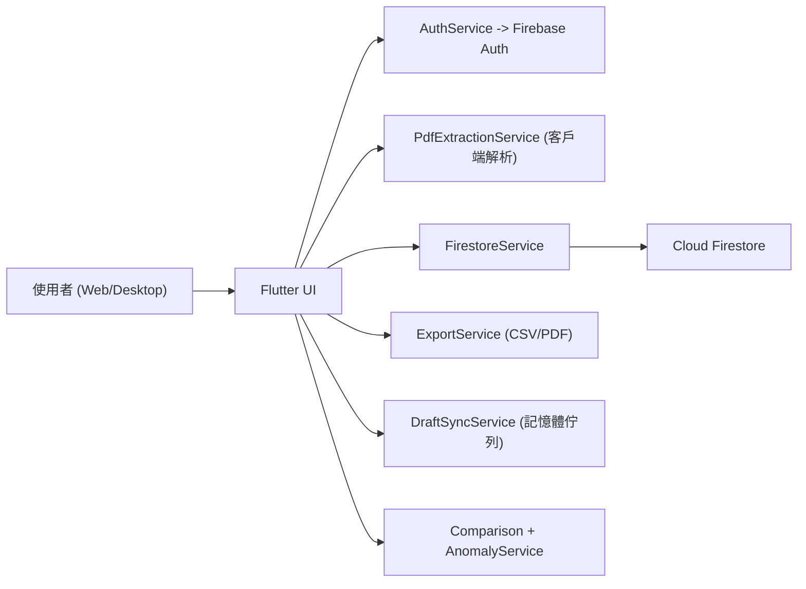

# Tax Auto Extraction：系統設計深度解析

最後更新：2026-05-08

## 1) 執行摘要

此系統為以客戶端為核心的 serverless Flutter 應用，後端使用 Firebase Auth 與 Firestore。  
核心流程：

1. 使用者透過 Firebase Auth 驗證。
2. 使用者從裝置上傳 PDF。
3. 客戶端將 PDF 解析為符合 ATO 的 `TaxRecord`。
4. 使用者在工作表畫面檢視/編修資料。
5. App 將每位使用者的資料寫入 Firestore，並由 rules 進行擁有權與欄位驗證。
6. App 在客戶端進行歷史趨勢呈現與異常偵測。

主要設計目標：在單使用者租戶模型下，以低維運成本快速交付，並確保每位使用者資料隔離。

## 2) 架構總覽

主要邊界：

- UI 層：`lib/screens/*`
- 領域模型：`lib/models/tax_record.dart`
- 服務/資料層：`lib/services/*`
- 儲存安全邊界：`firestore.rules`

## 3) 目前資料模型

Firestore 路徑策略：

- `users/{userId}/tax_records/{recordId}`
- `users/{userId}/settings/mappings`
- `users/{userId}/properties/{propertyId}`

主要實體：`TaxRecord`

- 識別與擁有權：`id`, `userId`
- 時間分區：`financialYear` 字串（`YYYY-YYYY`）
- 資料內容：
  - `income: Map<String, double>`
  - `expenses: Map<String, double>`
  - `lineItems: List<Map<String, dynamic>>`
- 作業中繼資料：`createdAt`, `updatedAt`, `sourceFileName`, `sourceParser`, `parserVersion`
- UX/業務旗標：`propertyId`, `propertyName`, `notes`, `isLocked`

## 4) 為何選這些資料結構

### 4.1 `income` / `expenses` 使用 `Map<String, double>`

目前選擇：

- 以分類名稱作為 key 的 `Map<String, double>`。

選擇原因：

- 在工作表中編輯單一分類可 O(1) 更新。
- 彙總（收入/支出/淨額）可直接 `sum(values)`。
- 對解析規則與自訂映射具彈性，分類擴充成本低。
- 符合 UI 以分類名稱呈現的資料型態。

替代方案：

- `List<CategoryAmount>`，每筆為 `{categoryId, amount}`。

取捨：

- `List` 對嚴格 schema 與排序控制更好。
- `Map` 對更新簡潔性與分類演進更有利。

何時切換：

- 當分類體系需要嚴格版本化，且要跨使用者做分類維度查詢時。

### 4.2 `financialYear` 使用字串（`YYYY-YYYY`）

目前選擇：

- 正規化字串，並以 UI 與 rules 的 regex 驗證。

選擇原因：

- 可讀性高、可直接顯示。
- 字典序可直接排序時間軸。
- 避免時區與日期邊界複雜度。

替代方案：

- 兩個整數欄位（`startYear`, `endYear`）或單一 `startYear`。

取捨：

- 整數欄位型別更嚴格、驗證更直觀。
- 字串對目前表單導向場景更簡單且已受約束。

何時切換：

- 若需要更進階的日期運算或不同財務年度規則。

### 4.3 使用者範圍子集合（`users/{uid}/...`）

目前選擇：

- 以路徑層級做租戶分區。

選擇原因：

- 安全規則清楚（`request.auth.uid == userId`）。
- 降低跨使用者誤讀/誤查風險。
- 文件天然以使用者聚合。

替代方案：

- 頂層 `tax_records` + `userId` 欄位 + 複合索引。

取捨：

- 頂層集合對全域分析更友善。
- 子集合對資料隔離與安全可讀性更好。

何時切換：

- 當管理端/跨使用者分析變成一級需求時。

### 4.4 `lineItems` 使用 `List<Map<String, dynamic>>`

目前選擇：

- 保持彈性的原始解析項目格式。

選擇原因：

- 解析器可快速輸出可變欄位。
- 支援追溯來源（`sourceCategory`, `mappedCategory`, `amount`, `isIncome`）。
- 強化預覽與人工覆核透明度。

替代方案：

- 強型別 `LineItem` 模型 + schema 版本。

取捨：

- 強型別有利於安全性與遷移治理。
- 動態 map 可降低解析規則演進成本。

何時切換：

- 當 line item 語義穩定，並成為報表/稽核關鍵資料時。

### 4.5 重複資料處理策略（先查 `year + property` 再寫入）

目前選擇：

- 先查同 `financialYear` + `propertyId`，再更新/覆蓋。

選擇原因：

- 符合使用者可理解的覆蓋行為。
- 避免隨機 document id 下的硬碰撞問題。

替代方案：

- 決定性 document id，例如 `${propertyId}_${financialYear}`。

取捨：

- 決定性 id 可直接建立唯一性、少一次查詢。
- 查詢式方案對未來唯一性政策調整較有彈性。

何時切換：

- 寫入併發風險上升或需要嚴格唯一性保證時。

### 4.6 記憶體暫存草稿佇列（離線重試）

目前選擇：

- `DraftSyncService` singleton 以記憶體存 pending drafts。

選擇原因：

- 實作簡單，可快速處理暫時性寫入失敗。
- 不增加本地儲存依賴。

替代方案：

- 本地持久化佇列（`Hive`/`sqflite`/IndexedDB）。

取捨：

- 記憶體佇列簡單但重啟會遺失。
- 持久化更可靠，但要增加 schema/migration/sync 複雜度。

何時切換：

- 當「重啟後仍可復原草稿」成為硬性需求時。

## 5) 服務設計與取捨

### 5.1 `PdfExtractionService`

目前：

- 客戶端解析器，含版型判斷（`Forge` / generic）、規則映射、自訂映射、信心分數、未映射項目。

優點：

- 不需後端解析基礎設施。
- 可即時回饋預覽，UX 佳。
- 降低伺服器成本。

缺點：

- 解析修正需發版。
- 效能受使用者裝置影響。
- 緊急修補解析邏輯較難集中控管。

替代方案：

- 後端解析（Cloud Functions / Cloud Run）。

取捨：

- 後端方案利於集中治理與一致性。
- 但提高延遲、基礎設施複雜度與檔案傳輸風險面。

### 5.2 `FirestoreService`

目前：

- 對 Firestore 的薄封裝，包含路徑慣例與儲存策略。

優點：

- 易於測試替身（mock）。
- UI 不直接依賴 Firestore API。

缺點：

- 某些策略（例如重複處理）仍在 app 層，唯一性沒有在資料庫層完全封裝。

替代方案：

- 加入更完整的 domain service / transaction abstraction。

### 5.3 `AnomalyService`

目前：

- 固定門檻（30%）的年對年百分比變動偵測。

優點：

- 解釋性高、行為可預期、成本低。

缺點：

- 基期過小時容易誤判。
- 不含季節性/統計穩健性。

替代方案：

- Rolling median band、z-score 或模型式異常偵測。

## 6) 安全架構

現有控制：

- 必須通過驗證才能存取。
- 路徑級擁有權檢查（`isOwner(userId)`）。
- `tax_records` 欄位 allowlist + 基礎型別/長度檢查。
- 文字欄位長度限制。

優勢：

- 租戶隔離模型清楚。
- 可阻擋未知/多餘欄位寫入。

目前缺口：

- `income`/`expenses` 的 key 與數值範圍未做深層驗證。
- `lineItems` 僅驗證為 list，未逐項驗證結構。
- `year+property` 唯一性由 app 層控制，非 rule 層強制。

可行強化：

- 改為可驗證的 typed nested map。
- 以 Cloud Functions 作寫入閘道強化驗證。
- 使用決定性 ID 在模型層建立唯一性。

## 7) 可擴展性與效能考量

目前規模特性：

- 適合早期、以單使用者資料集為主的場景。
- 讀取模式為 user 全部記錄串流後，於客戶端再依 property 過濾。

潛在瓶頸：

- 記錄與物件數量上升後，客戶端過濾成本增加。
- PDF 解析在低階裝置可能耗時。

替代策略：

- 直接以 `propertyId` + 年度排序查詢（需索引規劃）。
- 分頁載入歷史資料。
- 預先計算趨勢聚合資料。

## 8) 可靠性與失敗處理

目前：

- 儲存失敗時加入記憶體草稿佇列並提供重試。
- Home 頁可嘗試同步暫存草稿。

取捨：

- 對短暫失敗有良好 UX，但佇列不具持久性。

替代方案：

- 持久化本地佇列 + backoff + 同步狀態管理。

## 9) 測試架構

目前：

- 以單元/Widget 測試為主，覆蓋率高。
- Patrol Chrome E2E 覆蓋關鍵流程。

優勢：

- 對 UI 流程與 service 行為有高信心。

缺口：

- 尚缺真實 emulator 環境下的 rules/索引限制整合測試。

替代方案：

- 增加 Firebase Emulator 整合測試（rules reject/allow 邊界）。

## 10) 深度提問準備（Q&A）

### 架構面

Q: 為什麼選 Firebase serverless，而不是自建後端？  
A: 目標是降低維運與加速交付；在使用者分區場景下，Auth + Rules 提供足夠可控的安全邊界。

Q: 為什麼 PDF 解析放客戶端？  
A: MVP 階段優先速度與成本；即時預覽也提升使用者修正效率。

Q: UI 與資料邏輯如何切分？  
A: Screen 做流程編排；Auth/Parser/Firestore/Export/Anomaly 由 service 封裝。

### 資料結構面

Q: 為什麼分類資料用 `Map` 而非 `List`？  
A: 單點更新與彈性更佳；若進入嚴格治理與分析階段，可轉為強型別 list。

Q: 為何 `financialYear` 用字串？  
A: 顯示與排序直接、成本低；若進階分析需求增加，可改雙整數欄位。

Q: 如何避免同年度重複資料？  
A: 先以 `financialYear + propertyId` 查詢，預設覆蓋；另有 Save As New Year 複製流程。

### 安全面

Q: 租戶隔離如何保證？  
A: 路徑分區 + rules 擁有權檢查（`request.auth.uid == userId`）。

Q: 可否寫入不預期欄位？  
A: `tax_records` 使用 keys allowlist，未知欄位會被拒絕。

Q: 目前 rules 最大風險是什麼？  
A: `lineItems` 與 category map 深度驗證不足，唯一性仍偏 app 邏輯。

### 可靠性面

Q: 寫入失敗時行為？  
A: 先進記憶體佇列，立即提示可重試，再由同步流程補償。

Q: 為何不直接做持久化離線？  
A: 目前以 MVP 複雜度控制為主；持久化是下一階段可靠性升級項。

### 效能面

Q: 哪裡最可能先出現瓶頸？  
A: 客戶端 PDF 解析、與大量記錄下的客戶端過濾。

Q: 第一個優化會做什麼？  
A: 先改為依 property 查詢，再視情況加分頁/聚合。

### 擴充面

Q: 如何支援新物管 PDF 格式？  
A: 擴充 parser layout/規則映射；目前已有 parser metadata/version 可承接。

Q: 自訂映射如何演進？  
A: 以每位使用者設定文件儲存，解析時優先套用自訂映射。

## 11) 可替代架構路徑

路徑 A：維持現況，優先強化 rules 與離線持久化。  
路徑 B：導入後端解析服務，保留 Firestore 資料模型。  
路徑 C：改決定性 ID + 強型別 line-item schema + emulator 驗證閘道。

建議演進順序：

1. `propertyId + financialYear` 決定性記錄 ID。
2. 草稿佇列持久化。
3. 依 property 的查詢優化。
4. 若格式變異/裝置效能成為痛點，再評估後端解析。

## 12) 深度審查會議檢核表

- 每個簡化是否可被清楚定義為 MVP 有意取捨？
- 是否明確定義「何時切換到替代方案」的觸發條件？
- rules 風險是否已揭露並有明確補強路線？
- 唯一性策略是否可接受目前併發寫入風險？
- 離線可靠性目標是否有定義可驗證的 SLA？
